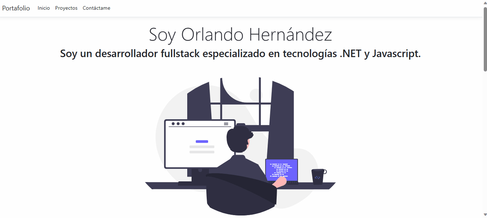

# Portafolio Web ASP. NET CORE 6.

Proyecto realizado con el objetivo de aprender los fundamentos de asp .net core 6 y compartir a todos un pequeño resumen sobre mí.

En este proyecto se aprendió los siguientes fundamentos:

- Controladores. 
- Vistas. 
- Modelos. 
- Layout. 
- Ruteo. 
- Vistas parciales 
- Razor 
- Principio de responsabilidad unica.
- Inyección de dependencias. 
- Servicios, 
- Introducción a HTTP.
- Envío de correos con un proveedor externo (SendGrid).

## Funcionamiento.

